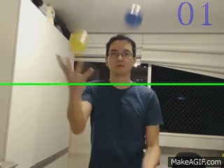

# conta-bolas
Python OpenCV juggling balls counter

Uses Python2 and Debian's python-opencv 2.4.9.1 package

It was inspired by a [tweet](https://twitter.com/nedbat/status/682632559310860289) and a [blog post](http://nedbatchelder.com/blog/201512/flip_turns_and_five_balls.html) from Ned Batchelder.

Right now, it only counts how many times a red object crosses a green line going up.

My goal is to make an interactive juggling game that will encourage people to try juggling.

Would you help me? Contribute with pull requests!

Vídeo: https://youtu.be/95rSO4VFfr8

gif: http://makeagif.com/i/PdSEaP
